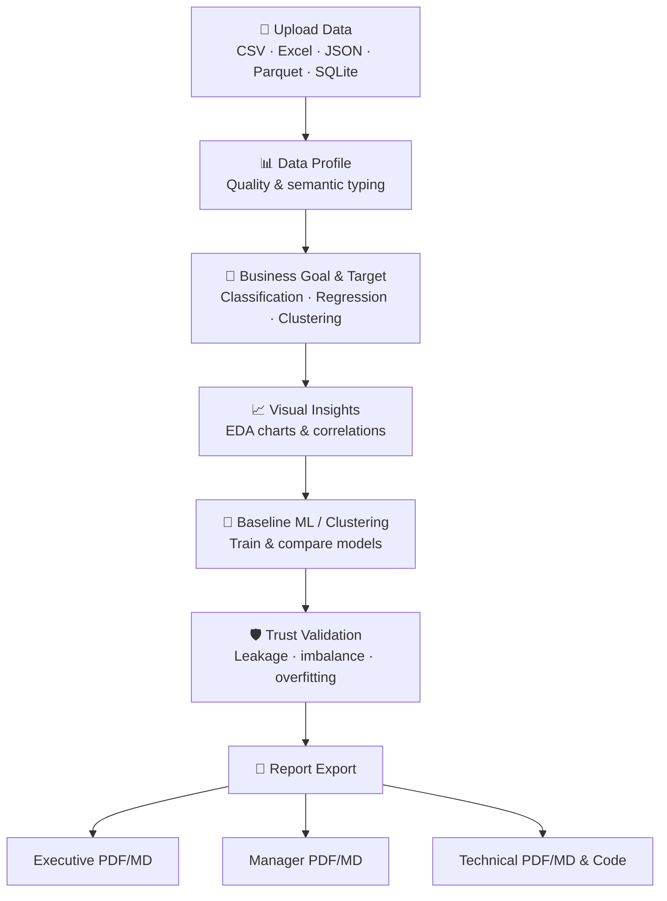
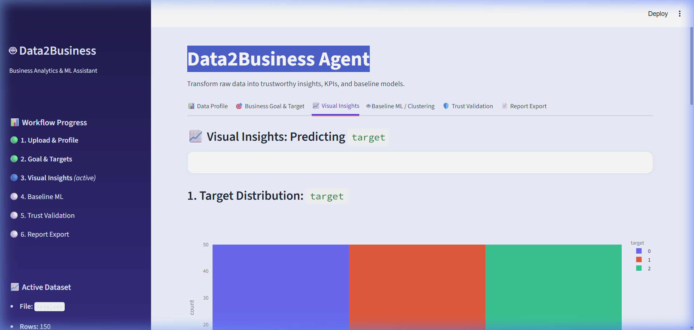

# 🤖 Data2Business Agent

**Transform raw data into trustworthy insights, KPIs, and baseline ML models.**

Data2Business Agent is an end-to-end, interactive analytics application built with [Streamlit](https://streamlit.io/). It guides users—students, analysts, researchers, and business teams—through a structured workflow: from dataset upload and profiling, through KPI identification and exploratory visualization, to automated machine learning, trust validation, and multi-audience report generation.

---

## 🔄 Workflow



---

## ✨ Key Features

### 📊 Data Profiling & Quality Assessment
- Accepts **CSV, Excel, JSON, Parquet, and SQLite** files.
- Automatically profiles rows, columns, missing values, duplicates, and data completeness.
- Infers semantic column types: **Numeric, Categorical, Datetime, ID, Text, Boolean**.
- Presents a sortable column-level summary with statistics and top values.

### 🎯 Intelligent KPI & Target Recommendation
- Scores columns by entropy, naming patterns, and uniqueness to recommend the best **target variable** and potential **KPIs**.
- Supports **Classification**, **Regression**, and **Clustering** task types with auto-detection.

### 📈 Interactive Visual Insights (EDA)
- **Target distribution** charts with distinct color palettes for supervised tasks.
- **Numeric correlation heatmaps** and **top-feature bar charts**.
- **Feature-vs-target** scatter, box, and violin plots (adapts to task type).
- **Clustering mode**: feature distributions colored by cluster assignment, PCA/t-SNE projections.

### 🤖 Baseline Machine Learning Pipeline
- Automated preprocessing: imputation, scaling, one-hot encoding.
- **Classification** models: Logistic Regression, Random Forest, HistGradient Boosting.
- **Regression** models: Ridge Regression, Random Forest, HistGradient Boosting.
- **Clustering** models: K-Means, Gaussian Mixture (GMM).
- Automatic champion model selection with cross-validation.
- Interactive diagnostic charts: confusion matrices, ROC curves, residual plots, silhouette analysis.

### ⏳ Animated Training Dashboard
- Real-time loading animation with rotating dataset facts displayed during model training.
- Shows dataset dimensions, completeness, and pipeline progress while the server computes.

### 🛡️ Automated Trust & Validation
- Checks for **target leakage**, **severe class imbalance**, and **high feature multicollinearity**.
- Detects **overfitting** (train vs. test metric divergence), **high missingness**, and **small sample sizes**.
- Clustering-specific checks: **silhouette quality**, **Davies-Bouldin index**, **cluster size imbalance**.
- Color-coded severity badges: 🔴 Critical, 🟡 Warning, 🟢 Info.

### 📄 Multi-Audience Report Export
- Generates structured reports for **Executive**, **Manager**, and **Technical** audiences.
- Export formats: **Markdown**, **styled PDF** (with embedded charts), **reproducible Python script**.
- One-click **ZIP bundle** download containing all report artifacts.

---

## 📸 Screenshots

### Data Profiling


### Visual Insights (EDA)


### Machine Learning Modeling


### Trust & Validation Log


### Report Export


---

## 🛠️ Installation & Setup

### Prerequisites
- **Python 3.10+** (tested on 3.11)
- `pip` package manager

### Local Development

```bash
# 1. Clone the repository
git clone https://github.com/<your-username>/Data2Business-Agent.git
cd Data2Business-Agent

# 2. Create and activate a virtual environment
python -m venv .venv

# Windows PowerShell
.venv\Scripts\activate

# macOS / Linux
source .venv/bin/activate

# 3. Install dependencies
pip install -r requirements.txt

# 4. Launch the application
streamlit run app.py
```

The app opens at **http://localhost:8501** by default.

### Docker

```bash
# Build the image
docker build -t data2business-agent .

# Run the container
docker run -p 8080:8080 data2business-agent
```

### Google Cloud Run

The project includes a `Dockerfile` and `.gcloudignore` pre-configured for Cloud Run deployment:

```bash
gcloud run deploy data2business-agent \
  --source . \
  --region europe-west1 \
  --allow-unauthenticated
```

---

## 🧪 Running Tests

```bash
python -m pytest tests/ -v
```

Or with `unittest` directly:

```bash
python -m unittest discover -s tests -v
```

The test suite covers:
- Dataset loading and profiling
- Semantic type inference
- ML pipeline preprocessing, training, and evaluation
- Validation checks (leakage, imbalance, multicollinearity)
- Report generation (Markdown, PDF, reproducible code)

---

## 📁 Repository Structure

```
Data2Business-Agent/
├── app.py                  # Streamlit entry point – multi-tab dashboard
├── requirements.txt        # Python dependencies
├── Dockerfile              # Container image for Cloud Run
├── .gitignore              # Git ignore rules
├── .gcloudignore           # Cloud Build ignore rules
├── iris.csv                # Sample dataset for quick demo
├── assets/                 # Screenshots for documentation
│   ├── profiling.png
│   ├── eda.png
│   ├── ml_modeling.png
│   ├── trust_log.png
│   ├── reporting.png
│   └── dashboard.png
├── src/                    # Core modules
│   ├── __init__.py
│   ├── profiler.py         # Data loading, profiling, KPI recommendation
│   ├── ml_engine.py        # ML pipelines, training, evaluation, charts
│   ├── validator.py        # Trust & validation checks
│   └── reporter.py         # Report generation (MD, PDF, code, ZIP)
└── tests/
    └── test_modules.py     # Unit tests for all modules
```

---

## 📦 Dependencies

| Package | Purpose |
|---------|---------|
| `streamlit` | Interactive web dashboard |
| `pandas` | Data manipulation |
| `numpy` | Numerical operations |
| `plotly` | Interactive charts |
| `scikit-learn` | Machine learning pipelines |
| `fpdf2` | Styled PDF report generation |
| `matplotlib` / `seaborn` | Static chart generation for reports |
| `statsmodels` | Statistical analysis utilities |
| `openpyxl` | Excel file support |
| `pyarrow` | Parquet file support |
| `jinja2` | Template rendering |

---

## 📝 License

This project was developed as a capstone project. Please check with the repository owner for licensing details.
