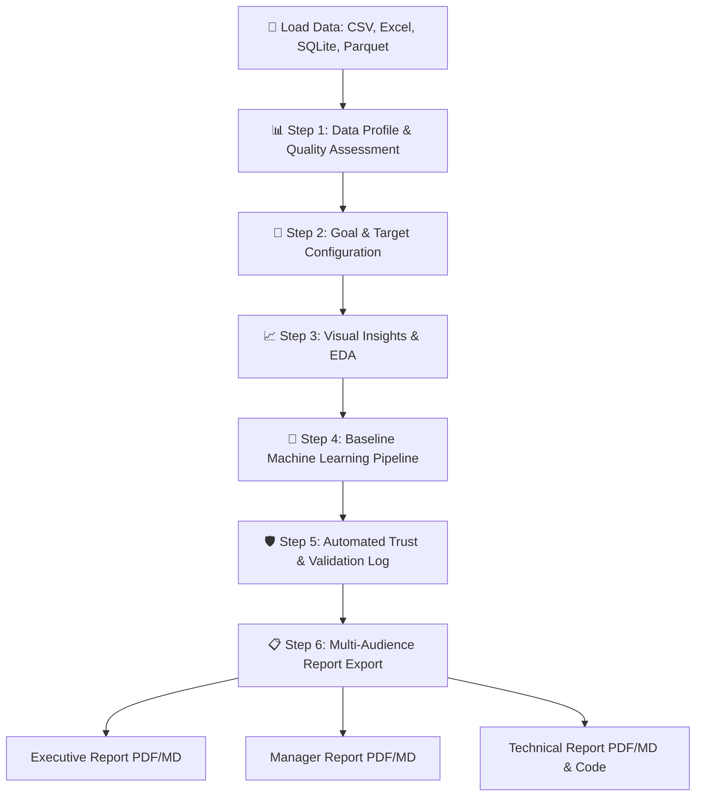
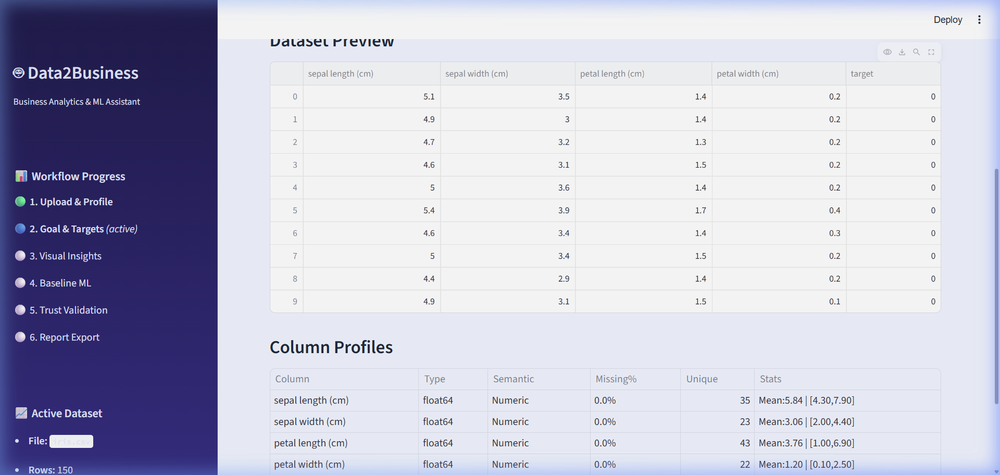
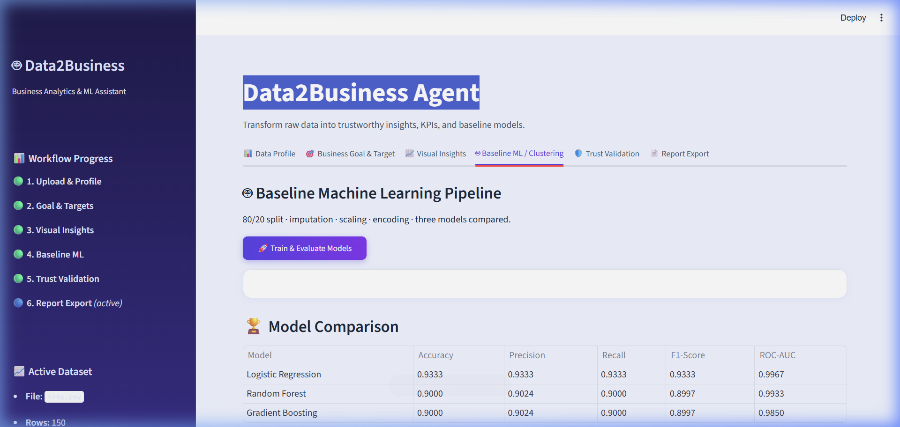
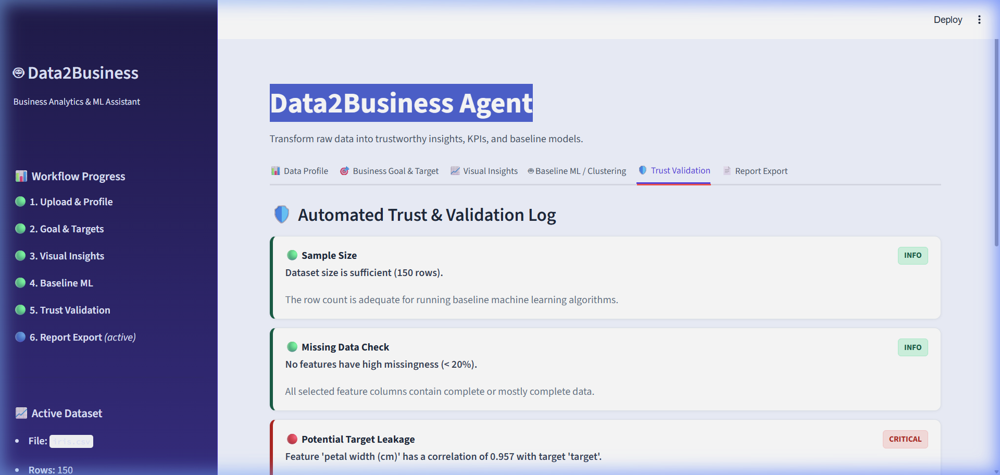
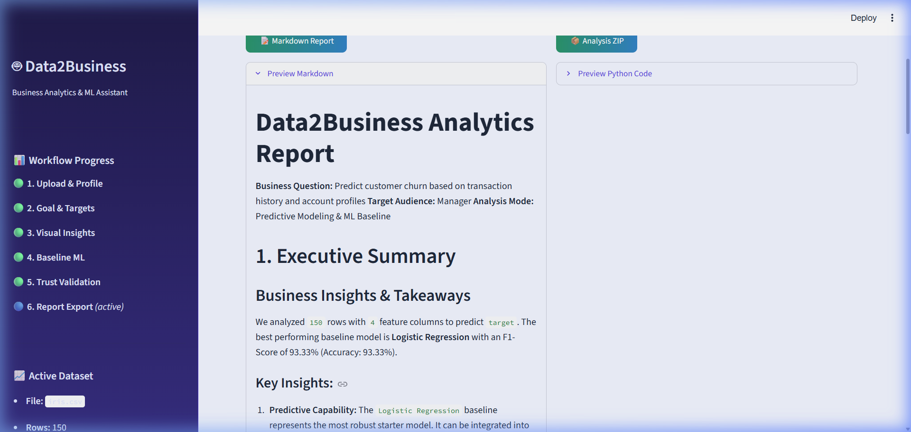

# Data2Business Agent - Business Analytics & Machine Learning Assistant

**Data2Business Agent** is an interactive, intelligent web application designed for students, analysts, researchers, and business teams. It automates dataset profiling, exploratory data analysis (EDA), KPI identification, automated trust validation, machine learning modeling, and premium multi-audience reporting.

---

## 🔄 Workflow Diagram

The following diagram illustrates the end-to-end workflow of the Data2Business Agent, showing how raw data is transformed into validated insights and tailored business reports:



---

## 🚀 Key Features

1. **Flexible Data Loading & Profiling:** Upload CSV, Excel, JSON, Parquet, or SQLite databases. The agent profiles data sizes, column types, missing values, duplicates, and general data completeness.
2. **Interactive EDA Visualizations:** Instantly view Plotly charts for target distribution, numeric correlations, and predictive feature relationship plots.
3. **Automated KPI & Target Suggestion:** Intelligent recommendation engine suggests classification or regression target variables based on naming patterns, semantic structure, and entropy.
4. **Baseline Machine Learning Pipeline:** Automatically handles data splitting, numeric scaling, median imputation, and categorical encoding. Trains and compares Logistic Regression/Ridge, Random Forests, and Gradient Boosting models, choosing the champion model automatically.
5. **🛡️ Trust & Validation Log:** Runs diagnostic checks to flag potential target leakage, severe class imbalances, high feature multicollinearity, overfitting, high missingness, and sample size constraints.
6. **Tailored Reporting & Exports:** Generates reports structured for **Executive**, **Manager**, or **Technical** audiences. Downloads include Markdown reports, styled PDFs with embedded visualizations, fully executable reproducible Python scripts, and a complete ZIP package.

---

## 📸 Application Interface & Screenshots

### 1. Data Profiling & Quality Assessment
Analyze dataset properties, structure, missing data, and semantic types immediately upon upload.


### 2. Interactive Exploratory Data Analysis (EDA)
Identify relationships, numeric correlations, and distribution characteristics through beautiful Plotly charts, including a Feature vs Target plot.


### 3. Machine Learning Modeling Baseline
Automatically train, evaluate, and compare Logistic Regression, Random Forest, and Gradient Boosting models.


### 4. Automated Trust & Validation Log
Audit modeling hazards, multicollinearity, target leakage, and overfitting indicators.


### 5. Multi-Audience Reporting & Export
Export highly polished PDF or Markdown reports tailored to technical, managerial, or executive stakeholders.


---

## 🛠️ Installation & Setup

1. **Activate Virtual Environment:**
   Run in PowerShell:
   ```powershell
   .venv\Scripts\activate
   ```

2. **Install Dependencies:**
   Dependencies are defined in `requirements.txt`:
   ```bash
   pip install -r requirements.txt
   ```

3. **Launch the Dashboard Application:**
   Start the interactive Streamlit dashboard:
   ```bash
   streamlit run app.py
   ```

---

## 📁 Repository Structure

- `app.py`: Streamlit entry point coordinating the multi-step user dashboard.
- `requirements.txt`: Python package requirements.
- `src/`:
  - `profiler.py`: Loads tabular files and SQLite tables, infers semantic datatypes, and recommends KPIs/targets.
  - `ml_engine.py`: Implements Scikit-learn pipelines, model baselines training, metrics evaluation, and Plotly interactive diagnostic charts.
  - `validator.py`: Evaluates data quality and modeling hazards (leakage, overfitting, class imbalances).
  - `reporter.py`: Exports tailored reports (Markdown, styled PDF via FPDF2) and reproducible python script.
- `tests/`:
  - `test_modules.py`: Automated unit test suite verifying each module's pipeline logic.
- `assets/`: Contains screenshots of the application.
